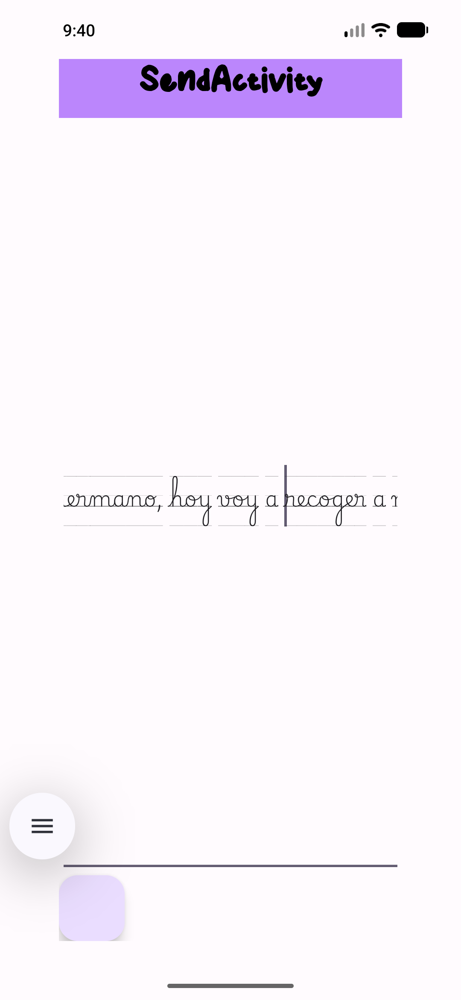
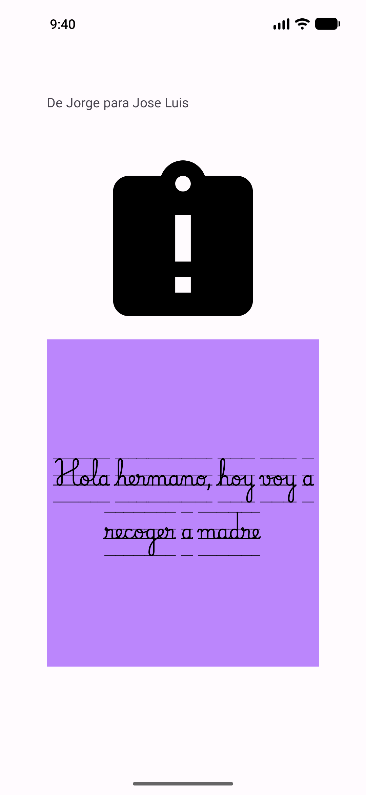
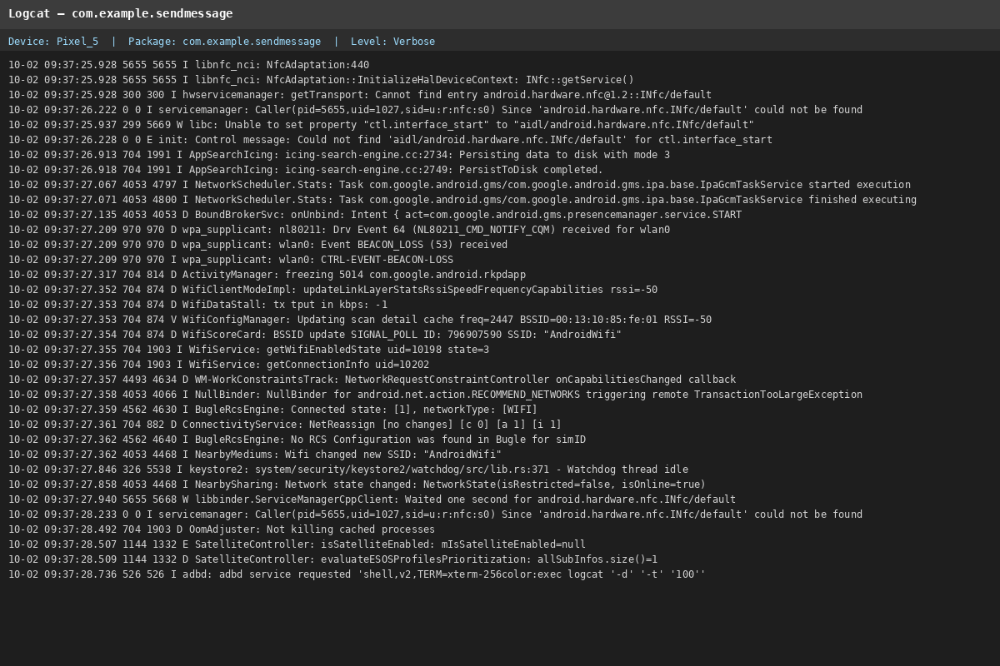
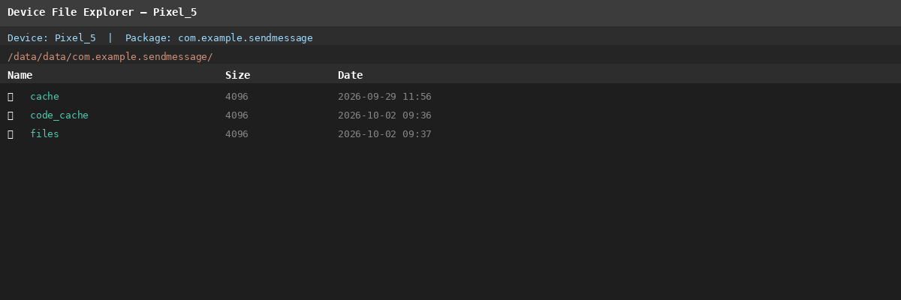

# SendMessage — Android Kotlin Intent & Bundle Demo App

> **[IA]** Aplicación Android de ejemplo desarrollada en **Kotlin** que demuestra cómo enviar un mensaje de texto entre dos actividades utilizando `Intent` y `Bundle`. Proyecto educativo para aprender los fundamentos de la comunicación entre componentes en **Android development**.

---

## Características

- ✅ **Dos actividades** con navegación mediante `Intent` explícito
- ✅ **Transferencia de datos** con `Bundle` (clave-valor)
- ✅ **Interfaz sencilla** con `EditText`, `Button` y `TextView`
- ✅ **Soporte edge-to-edge** en la segunda actividad
- ✅ **Fuentes personalizadas** y estilos visuales coherentes
- ✅ **Tests unitarios** y **tests instrumentados** de ejemplo
- ✅ **Documentación KDoc** en todas las clases y métodos

---

## Capturas de Pantalla

### Pantalla 1 — SendMessageActivity (Escritura)



### Pantalla 2 — ViewMessageActivity (Visualización)



---

## Evidencias de Depuración (Logcat)



---

## Conexión al Directorio /data/data/



---

## Arquitectura y Stack Tecnológico

### Patrón de Arquitectura

La aplicación sigue un **patrón de navegación basado en actividades** (Activity-based navigation), que es el enfoque clásico de Android para la comunicación entre pantallas.

```
┌─────────────────────┐         Intent + Bundle         ┌─────────────────────┐
│  SendMessageActivity │  ───────────────────────────►  │ ViewMessageActivity │
│  (Pantalla origen)   │                                 │  (Pantalla destino)  │
└─────────────────────┘                                 └─────────────────────┘
```

### Stack Tecnológico

| Capa | Tecnología | Descripción |
|---|---|---|
| **Lenguaje** | Kotlin | Lenguaje principal de desarrollo Android |
| **UI** | XML Layouts | Diseño de interfaces con LinearLayout y ConstraintLayout |
| **Componentes UI** | Material Design | Componentes visuales de Android |
| **Navegación** | Intent | Comunicación entre actividades |
| **Transferencia de datos** | Bundle | Contenedor clave-valor para adjuntar datos al Intent |
| **Build System** | Gradle (KTS) | Sistema de compilación con Kotlin DSL |
| **Testing** | JUnit + Espresso | Tests unitarios y tests instrumentados |

### Estructura del Proyecto

```
SendMessage/
├── app/
│   ├── src/
│   │   ├── main/
│   │   │   ├── java/com/example/sendmessage/
│   │   │   │   ├── SendMessageActivity.kt      ← Pantalla 1: escribir mensaje
│   │   │   │   ├── ViewMessageActivity.kt      ← Pantalla 2: ver mensaje
│   │   │   │   └── SendMessageApplication.kt   ← Clase Application
│   │   │   ├── res/
│   │   │   │   ├── layout/
│   │   │   │   │   ├── activity_send_message.xml
│   │   │   │   │   └── activity_view_message.xml
│   │   │   │   ├── values/
│   │   │   │   │   ├── strings.xml
│   │   │   │   │   ├── colors.xml
│   │   │   │   │   ├── dimens.xml
│   │   │   │   │   └── themes.xml
│   │   │   │   └── font/
│   │   │   │       ├── stay_fun.ttf
│   │   │   │       └── playwrite_bewal_guides_regular.ttf
│   │   │   └── AndroidManifest.xml
│   │   ├── test/
│   │   │   └── ExampleUnitTest.kt              ← Test unitario
│   │   └── androidTest/
│   │       └── ExampleInstrumentedTest.kt      ← Test instrumentado
│   └── build.gradle.kts
├── build.gradle.kts
├── settings.gradle.kts
├── gradle.properties
├── gradlew
├── FLUJO_DEL_MENSAJE.md    ← Documentación del flujo del mensaje
├── README.md               ← Este archivo
├── CHANGELOG.md            ← Historial de cambios
└── MANUAL_USUARIO.md       ← Manual de usuario en lenguaje sencillo
```

---

## Decisiones de Diseño

| Decisión | Justificación |
|---|---|
| **Intent explícito** | Se conoce la clase destino (`ViewMessageActivity`), por lo que un Intent explícito es más seguro y eficiente que uno implícito. |
| **Bundle para transportar datos** | El `Bundle` es el mecanismo estándar de Android para adjuntar datos a un `Intent`. Es tipo-seguro y fácil de usar. |
| **Clave "KEY_MESSAGE"** | Se usa una constante String como clave para evitar errores tipográficos al recuperar el valor. |
| **ConstraintLayout en ViewMessageActivity** | Permite posicionar los elementos de forma flexible y responsive, a diferencia del LinearLayout de la primera pantalla. |
| **Fuentes personalizadas** | Se usan las fuentes `stay_fun` y `playwrite_bewal_guides_regular` para dar un estilo visual distintivo y coherente entre ambas pantallas. |
| **Color morado (purple_200)** | Se mantiene el mismo color de fondo en ambas pantallas para crear una identidad visual consistente. |
| **Edge-to-edge** | La segunda actividad usa `enableEdgeToEdge()` para aprovechar todo el espacio de pantalla en dispositivos con gestos de navegación. |

---

## Cómo Funciona

### Envío de mensaje (SendMessageActivity)

```kotlin
// 1. Crear el Intent con la actividad destino
val intent = Intent(this, ViewMessageActivity::class.java)

// 2. Crear el Bundle para transportar datos
val bundle = Bundle()

// 3. Guardar el mensaje con una clave identificadora
bundle.putString("KEY_MESSAGE", etMensaje.text.toString())

// 4. Adjuntar el Bundle al Intent
intent.putExtras(bundle)

// 5. Iniciar la actividad destino
startActivity(intent)
```

### Recepción de mensaje (ViewMessageActivity)

```kotlin
// 1. Obtener el Intent que lanzó esta actividad
val bundle = intent.extras

// 2. Extraer el mensaje usando la misma clave
val mensaje = bundle?.getString("KEY_MESSAGE")

// 3. Mostrarlo en el TextView
tvFinalMessage.text = mensaje
```

> **📖 Para una explicación detallada paso a paso, consulta [FLUJO_DEL_MENSAJE.md](./FLUJO_DEL_MENSAJE.md).**

---

## Comenzando

### Requisitos Previos

| Requisito | Versión |
|---|---|
| **Android Studio** | Hedgehog o superior |
| **JDK** | 11 o superior |
| **minSdk** | 24 (Android 7.0) |
| **targetSdk** | 36 |
| **compileSdk** | 37 |
| **Lenguaje** | Kotlin |

### Instalación y Ejecución

1. **Clona o descarga** el repositorio en tu máquina local.
2. **Abre el proyecto** en **Android Studio**.
3. **Espera** a que Gradle sincronice las dependencias automáticamente.
4. **Conecta un dispositivo Android** o **inicia un emulador** (recomendado: Pixel 5).
5. **Pulsa Run** (▶️) para compilar y ejecutar la app en el dispositivo/emulador.

---

## Dependencias Principales

| Dependencia | Uso |
|---|---|
| `androidx.appcompat:appcompat` | Actividades compatibles con versiones anteriores |
| `androidx.core:core-ktx` | Extensiones de Kotlin para Android |
| `androidx.activity:activity-ktx` | Componentes de actividad con soporte a corrutinas |
| `androidx.constraintlayout:constraintlayout` | Layouts con restricciones para UI responsive |
| `com.google.android.material:material` | Componentes Material Design |
| `junit:junit` | Framework de tests unitarios |
| `androidx.test.ext:junit` | Extensión de JUnit para tests instrumentados |
| `androidx.test.espresso:espresso-core` | Framework de tests de UI |

---

## Enlaces a Documentación Oficial de Android

| Tema | Enlace |
|---|---|
| **Intent** | [https://developer.android.com/reference/android/content/Intent](https://developer.android.com/reference/android/content/Intent) |
| **Bundle** | [https://developer.android.com/reference/android/os/Bundle](https://developer.android.com/reference/android/os/Bundle) |
| **startActivity()** | [https://developer.android.com/reference/android/app/Activity#startActivity(android.content.Intent)](https://developer.android.com/reference/android/app/Activity#startActivity(android.content.Intent)) |
| **ConstraintLayout** | [https://developer.android.com/develop/ui/views/layout/constraint-layout](https://developer.android.com/develop/ui/views/layout/constraint-layout) |
| **EditText** | [https://developer.android.com/reference/android/widget/EditText](https://developer.android.com/reference/android/widget/EditText) |
| **TextView** | [https://developer.android.com/reference/android/widget/TextView](https://developer.android.com/reference/android/widget/TextView) |
| **Fuentes personalizadas** | [https://developer.android.com/develop/ui/views/text-and-fonts/fonts-in-xml](https://developer.android.com/develop/ui/views/text-and-fonts/fonts-in-xml) |
| **Edge-to-edge** | [https://developer.android.com/develop/ui/views/layout/edge-to-edge](https://developer.android.com/develop/ui/views/layout/edge-to-edge) |
| **Guía de actividades** | [https://developer.android.com/guide/components/activities/intro-activities](https://developer.android.com/guide/components/activities/intro-activities) |
| **Logcat** | [https://developer.android.com/studio/debug/logcat](https://developer.android.com/studio/debug/logcat) |
| **Device File Explorer** | [https://developer.android.com/studio/debug/device-file-explorer](https://developer.android.com/studio/debug/device-file-explorer) |

---

## Licencia

Este proyecto es de código abierto y se distribuye con fines educativos.

---

## Autor

Desarrollado como proyecto educativo para aprender el flujo de `Intent` y `Bundle` en Android con Kotlin.

---

*Documentación generada por [IA] — SendMessage Project*
